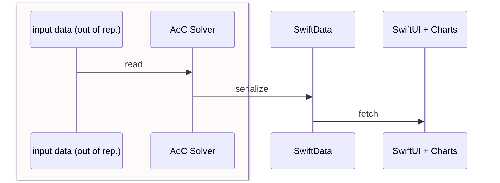

Run `direnv block` if there is version-incompatible or not-found error.

## Execution

```
swift run aoc [--save] --year 2025 1
```

## Visualization framework

Swift application (not CLI) can't read the content of file locating out of the project directly. So use SwiftData.




