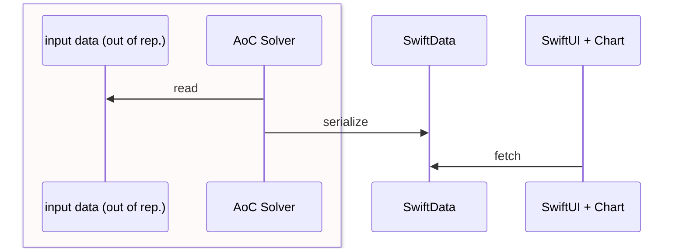

Run `direnv block` if there is version-incompatible or not-found error.

## Visualization framework

Swift application (not CLI) can't read the content of file locating out of the project directly. So use SwiftData.

